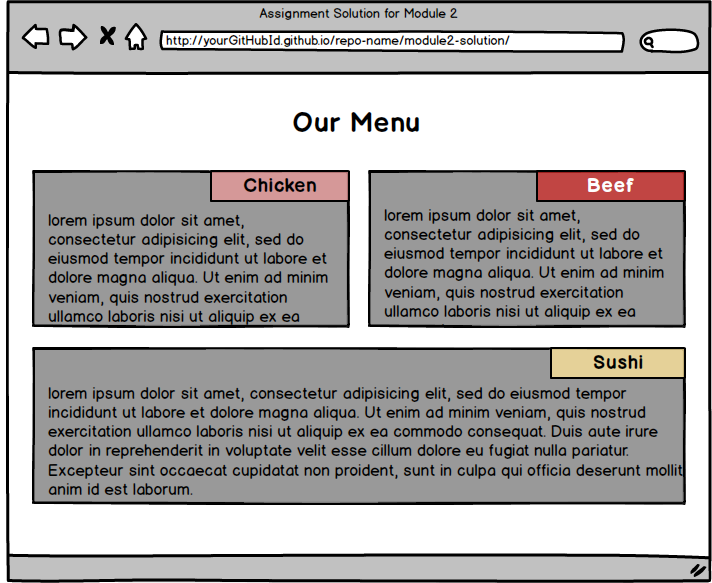

# Coursera: HTML, CSS, and JavaScript for Web Developers  

## Module 2 Coding Assignment

For this course, upon completion of Module 2 which introduces us to Cascading Style Sheets (CSS) Basics, CSS Rules Conflict Resolution and Text Styling, The Box Model and Layout, Introduction to Responsive Design, and a small introduction to the Twitter Bootstrap.

The assignment is to develop a simple but responsive website that adheres to some criteria as follows:

1. The implementation of the page should follow the mockup illustrations shown below. There are 3 mockups: desktop, tablet and mobile. However, the implementation has to be just 1 page and not 3 pages, that is a single responsive webpage has to be developed.
2. The page must include a CSS file. No inline styles allowed. The CSS file should be placed into a `css` folder under the solution container folder, e.g., `Module2-Assignment/css`.
3. Use of any CSS or JavaScript framework is not allowed, incluing Twitter Bootstrap CSS Framework. No framework CSS files should even be referenced in yout `index.html` file. However, use of simple responsive framework is to be used as a starting point for this assignment.
4. You must implement the following breakpoints that will be considered desktop, tablet, and mobile. The browser should display a desktop version of the site when the width of the browser window is 992px and above. Tablet view should appear only if the width of the browser window is between 768px and 991px, inclusively. Mobile view should appear only if the width of the browser is equal to or less than 767px.
5. Your site is very simple. It consists of a page heading and 3 sections (all in one row in the desktop view). Each section contains some text. You can make it dummy text/"lorem ipsum", it doesn't matter. How the sections are laid out on the screen depends on the width of the browser window. (Hint: use media queries discussed in Lecture 23.)
6. Layout: In the desktop view (992px and above), each of the 3 sections should take up equal amount of space on the screen. As you make the browser window wider or narrower, each section should become wider or narrower. (_Hint: use percentages to define width and use the 'float' property._). For a visual reference of this view, see the desktop mockup illustration below.
7. Layout: In the tablet view (between 768px and 991px, inclusively), the first 2 sections should be in the first row and be of equal size. The 3rd section should be in the second row and take up the entire row by itself. For a visual reference of this view, see the tablet mockup illustration below.
8. Layout: In the mobile view (equal to or less than 767px), each section should take up the entire row. For a visual reference of this view, see the mobile mockup illustration below.
9. Section title region: Each section should have a section title region that is always positioned at the top right corner of the section no matter the view (desktop, tablet or mobile). Copy the titles from the mockup illustration (i.e., Chicken, Beef, Sushi) or come up with your own. (_Hint: use relative and absolute positioning and offsets._)
10. Spacing: Pay attention to the spacing shown in the mockup illustrations. Note the spacing between sections (both horizontal and vertical). Note the horizontal spacing between the edges of the section and the edges of the browser window. Also, note the spacing between the dummy text in each section and the edges of the section. Lastly, make sure the dummy text is "pushed down" enough so it doesn't overlap the section title region. (_Hint: use margins and padding and use border-box as your box-sizing._)
11. Borders and Colors: Each section should have a background color set to some color (of your choosing). Set the background color of each section title region to some unique color (of your choosing). Make sure that the background color still allows the user to view the text in the section and section title regions. Depending on the color you choose, you may want to change the color of the text so it can be easy to read. Set a black border on both the section and section title region that is 1px thick.
12. (OPTIONAL) _You will NOT be graded on this_, but you may want to explicitly set a font-family for the text in your page, so you are not stuck with the default browser font family. Also, set the font size of the heading and section title to be 75% larger and 25% larger (respectively) than the font size of the dummy text.

### Mockup Illustrations:
Your mockups should look similar to the ones in the images below.

**Desktop**

**Tablet**

**Mobile**

